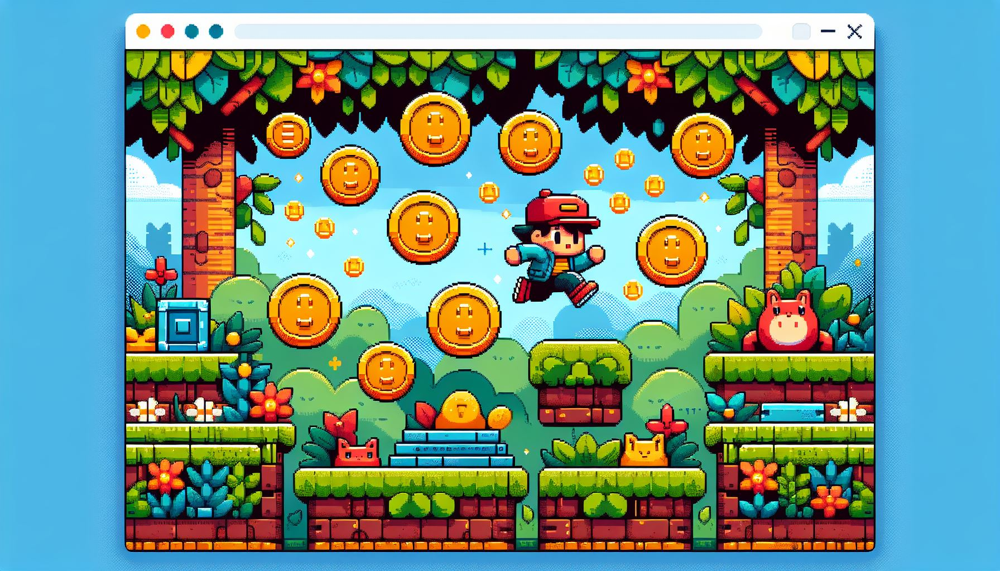

# Coin Collector Game with React Canvas



Welcome to my React basement!

This Coin Collector game is built using React and HTML5 Canvas where a player moves around the canvas to collect coins. It's a fun way to get started with game development in React.

# Table of Contents

- Prerequisites
- Installation
- Game Overview
- Gameplay
- Game Mechanics
- React Concepts
- Customization
- Support


### Prerequisites

- Basic knowledge of JavaScript.
- Replit's React JS Template.

### Installation

1. Clone the repository or download the source code.
2. Navigate to the project directory and run `npm install` to install dependencies.
3. Start the development server with `npm start`.

# Game Overview

The Coin Collector game features a player represented by a blue square that collects gold coins on a canvas. The goal is to collect a certain number of coins to win the game.

## Components

- **Canvas**: The area where the game takes place.
- **Player**: The character controlled by the user.
- **Coins**: Objects the player must collect.
- **Score**: A counter that increases each time the player collects a coin.

# Gameplay

- Use touch movements to control the player.
- Collect coins to increase your score.
- The game ends when you reach the winning score.

# Game Mechanics

**Movement**: The player uses touch or mouse input to move the character.

**Collision Detection**: The game checks if the player has collected a coin.

**Scoring**: Each coin collected increases the player’s score.

**Winning Condition**: The game ends when the player reaches the winning score.

## Code Structure

The main game logic is contained within the `CoinCollector` component. Here's a brief overview of the key functions:

- `generateCoins`: Places coins in random positions on the canvas.
- `checkCollision`: Detects if the player has collected a coin.
- `drawPlayer`: Renders the player on the canvas.
- `drawCoins`: Renders the coins on the canvas.
- `gameLoop`: The main loop that updates the game state.

## Touch Events

The game responds to touch events for player movement:

- `handleTouchStart`: Initiates player movement.
- `handleTouchMove`: Moves the player based on touch coordinates.
- `handleTouchEnd`: Ends the touch event.

## React Concepts Explained

This game is a practical application of several key React concepts. Understanding these will help you grasp how the game functions and how it leverages React's features.

### JSX
JSX is a syntax extension for JavaScript that looks similar to HTML. It is used with React to describe what the UI should look like. With JSX, you can write HTML structures in the same file as your JavaScript logic.

```Javascript
return (
  <>
    <canvas ref={canvasRef} />
    <p>Score: {score}</p>
  </>
);
```

### useState Hook

The `useState` hook is a fundamental part of React's Hooks API. It lets you add state to functional components. In this game, `useState` is used to track the player's score and the game over state.

```javascript
const [score, setScore] = useState(0);
const [gameOver, setGameOver] = useState(false);
```

### useRef Hook
`useRef` is another hook provided by React, which returns a mutable ref object. This object persists for the lifetime of the component. The game uses useRef to reference the canvas element and to keep track of the player’s position and score without re-rendering the component.

```JavaScript
const canvasRef = useRef(null);
const playerPosition = useRef({ x: 50, y: 50 });
const scoreRef = useRef(0);
```

### useEffect Hook
`useEffect` is used to perform side effects in function components. Side effects can be anything from data fetching to manually changing the DOM. We use useEffect to set up the canvas and start the game loop when the component mounts.

```JavaScript
useEffect(() => {
  // Canvas setup and game loop start
}, []);
```

### useCallback Hook
The `useCallback` hook returns a memoized version of the callback that only changes if one of the dependencies has changed. It’s useful when passing callbacks to optimized child components that rely on reference equality to prevent unnecessary renders. In our game, useCallback is used to define functions for generating coins and checking collisions.

```JavaScript
const generateCoins = useCallback(() => { /* ... */ }, []);
const checkCollision = useCallback((player, coin) => { /* ... */ }, []);
```

### Event Handling
React elements have built-in events that you can handle using attributes like `onClick`, `onTouchStart`, etc. In the game, touch events are used to control the player’s movement.

```JavaScript
canvas.addEventListener('touchstart', handleTouchStart);
```

### Canvas API
The HTML5 Canvas API is used in conjunction with React to draw the game’s graphics. It provides a surface for your game’s visual elements and a context that allows you to draw shapes, images, and other objects.


## Customization

Feel free to customize the game by:
- Changing the player and coin sizes.
- Adjusting the winning score.
- Adding new features like power-ups or obstacles.

## Conclusion

This game is a starting point for your journey into game development with React and Canvas. Experiment with the code, add new features, and have fun!

## Support

For questions or support, please contact me @joyboysk5@gmail.com

Happy coding 😁!